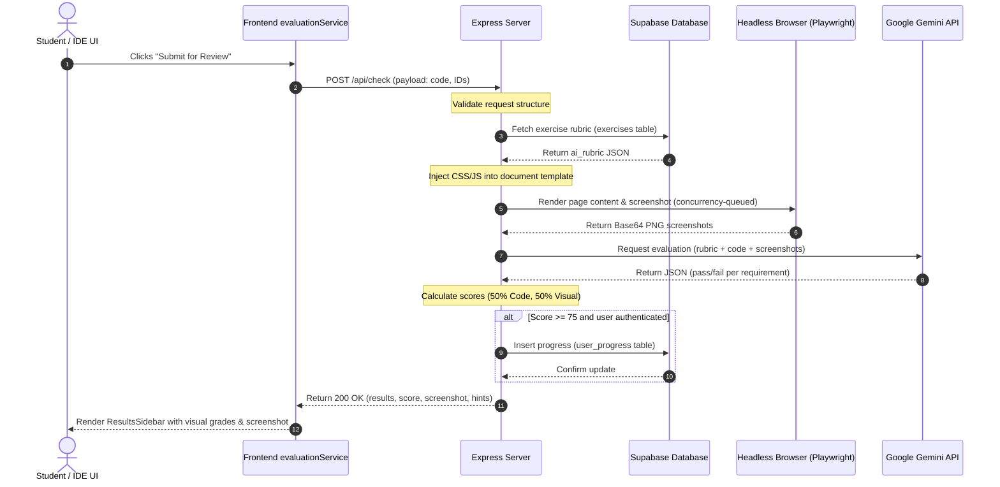

# Technical Documentation: DevDive

## 1. System Overview & Architecture
- **Primary Purpose:** DevDive is a local-first, self-paced web development learning platform. It allows users to browse a curriculum, read lessons, and write HTML/CSS/JS in a built-in browser IDE, providing real-time, AI-driven visual and code-level feedback.
- **Tech Stack:** React (Vite, TailwindCSS, Monaco Editor), Node.js (Express, Playwright), Supabase (PostgreSQL, Authentication)
- **Architectural Style:** Client-server architecture with stateful database/ledger and stateless content mapping. The frontend renders components, manages local storage workspace states, and handles routing. The backend provides a secure evaluation endpoint wrapping a headless browser rendering and AI visual comparison engine.

### Directory Tree & Component Mapping
```text
devdive/
├── .agents/
├── dist/
├── docs/
│   ├── agent_log/
│   ├── old/
│   └── relevant/
│       ├── DOCUMENTATION.md
│       ├── SUPABASE_ARCHITECHTURE.md
│       ├── SUPABASE_INTEGRATION_PLAN.md
│       └── supabase_migration.md
├── public/
├── server/
│   ├── lib/
│   │   └── supabase.js
│   ├── modules/
│   │   ├── ai/
│   │   │   ├── gemini.service.js
│   │   │   └── schemas.js
│   │   ├── browser/
│   │   │   └── playwright.service.js
│   │   └── evaluation/
│   │       ├── evaluation.controller.js
│   │       └── evaluation.routes.js
│   ├── utils/
│   │   └── helpers.js
│   └── index.js
├── src/
│   ├── assets/
│   ├── components/
│   │   └── QuizEngine.jsx
│   ├── core/
│   │   ├── components/
│   │   │   ├── Footer.jsx
│   │   │   └── Header.jsx
│   │   └── contexts/
│   │       └── AuthContext.jsx
│   ├── data/
│   ├── features/
│   │   ├── auth/
│   │   │   └── pages/
│   │   │       ├── LoginPage.jsx
│   │   │       ├── ProfilePage.jsx
│   │   │       └── SignupPage.jsx
│   │   ├── course/
│   │   │   ├── components/
│   │   │   │   ├── CourseTimeline.jsx
│   │   │   │   ├── Sidebar.jsx
│   │   │   │   ├── TimelineLesson.jsx
│   │   │   │   └── TimelineUnit.jsx
│   │   │   └── pages/
│   │   │       ├── CourseMap.jsx
│   │   │       └── LessonPage.jsx
│   │   └── ide/
│   │       ├── components/
│   │       │   ├── AddFileModal.jsx
│   │       │   ├── CodeEditor.jsx
│   │       │   ├── DeleteFileModal.jsx
│   │       │   ├── ExerciseContainer.jsx
│   │       │   ├── PlaygroundContainer.jsx
│   │       │   ├── ProblemSidebar.jsx
│   │       │   └── ResultsSidebar.jsx
│   │       └── pages/
│   │           ├── ExercisePage.jsx
│   │           └── PlaygroundPage.jsx
│   ├── lib/
│   │   └── supabaseClient.js
│   ├── services/
│   │   ├── courseService.js
│   │   ├── evaluationService.js
│   │   └── progressService.js
│   ├── utils/
│   │   └── htmlUtils.js
│   ├── App.css
│   ├── App.jsx
│   ├── index.css
│   └── main.jsx
├── eslint.config.js
├── index.html
├── inspect_db.js
├── package.json
├── tailwind.config.js
└── vite.config.js
```

---

## 2. Core Modules & Component Specifications

### Module: `src/App.jsx`
- **Description:** Root entry layout setting up React Router and binding the global authentication state provider.
- **Dependencies:** `react-router-dom`, `src/core/contexts/AuthContext.jsx`, `src/features/landing/pages/LandingPage.jsx`, `src/features/course/pages/CourseMap.jsx`, `src/features/course/pages/LessonPage.jsx`, `src/features/ide/pages/ExercisePage.jsx`, `src/features/ide/pages/PlaygroundPage.jsx`, `src/features/auth/pages/LoginPage.jsx`, `src/features/auth/pages/SignupPage.jsx`, `src/features/auth/pages/ProfilePage.jsx`

#### Component: `App`
- **Purpose:** Bootstrapping React application paths.
- **State/Properties:** None.
- **Methods:**
  - `App() -> JSX.Element`: Mounts `<AuthProvider>` and `<BrowserRouter>`, routing `/` to `LandingPage`, `/course-map` to `CourseMap`, `/lesson/:lessonId` to `LessonPage`, `/exercise/:exerciseId` to `ExercisePage`, `/playground` to `PlaygroundPage`, `/login` to `LoginPage`, `/signup` to `SignupPage`, and `/profile` to `ProfilePage`.

---

### Module: `src/core/contexts/AuthContext.jsx`
- **Description:** Encapsulates the application's authentication state using Supabase Identity Services.
- **Dependencies:** `react`, `src/lib/supabaseClient.js`

#### Context: `AuthContext`
- **Purpose:** Globally exposes user authentication state and logout functions.
- **State/Properties:**
  - `user`: `Object | null` - Cached authentication user metadata.
  - `loading`: `boolean` - Indicates active state lookup on initial mount.
- **Methods:**
  - `AuthProvider({ children }) -> JSX.Element`: Resolves `supabase.auth.getSession()` on mount, registers an active state subscription with `supabase.auth.onAuthStateChange()`, and exposes the current user context.
  - `signOut() -> Promise<void>`: Calls `supabase.auth.signOut()` to clear session.
  - `useAuth() -> Object`: Custom React hook exposing `user`, `loading`, and `signOut`.

---

### Module: `src/features/course/pages/CourseMap.jsx`
- **Description:** Displays the primary learning path and timelines.
- **Dependencies:** `react`, `src/features/course/components/CourseTimeline.jsx`, `src/core/components/Header.jsx`, `src/core/components/Footer.jsx`, `src/features/course/components/Sidebar.jsx`, `src/core/contexts/AuthContext.jsx`, `src/services/courseService.js`, `src/services/progressService.js`

#### Component: `CourseMap`
- **Purpose:** Loads course map layouts, queries user ledger milestones, and merges completion statuses.
- **State/Properties:**
  - `curriculum`: `Array` - Nested database unit objects with computed statuses.
  - `isLoading`: `boolean` - Tracks initialization states.
  - `error`: `string | null` - Populated on data load failures.
  - `isSidebarExpanded`: `boolean` - Controls layout state.
- **Methods:**
  - `useEffect()` (dependencies: `[user]`):
    1. Sets `isLoading = true`, resets `error = null`.
    2. Runs `fetchCurriculum()` and `fetchUserProgress(user?.id)` in parallel using `Promise.all`.
    3. Builds `completedLessons` and `completedExercises` Sets for fast ID lookups.
    4. Iterates through the curriculum structure, identifying if the unit contains exercises or raw theory lessons.
    5. Checks the numeric IDs against the lookup Sets. If matched, computed status is marked `'completed'`, else `'not_started'`.
    6. Updates state variables and clears the loader.

---

### Module: `src/features/course/pages/LessonPage.jsx`
- **Description:** Renders lesson content, sets up quiz states, and handles course navigation boundaries.
- **Dependencies:** `react`, `react-router-dom`, `react-markdown`, `rehype-raw`, `rehype-sanitize`, `src/core/components/Header.jsx`, `src/core/contexts/AuthContext.jsx`, `src/components/QuizEngine.jsx`, `src/services/courseService.js`, `src/services/progressService.js`

#### Component: `LessonPage`
- **Purpose:** Manages active reading state, dynamically resolves routes for neighboring modules, and logs theory completion.
- **State/Properties:**
  - `lessonId`: `string` - ID derived from routing parameters.
  - `lessonData`: `Object | null` - Relational fields for current lesson, unit, and quizzes.
  - `loading`: `boolean` - Tracks async fetching operations.
  - `error`: `string | null` - Capture validation/fetching errors.
  - `prevPath`: `string` - Resolved URL route to previous lesson/exercise.
  - `nextPath`: `string` - Resolved URL route to next lesson/exercise.
  - `isQuizMode`: `boolean` - Toggle to swap between reading view and Knowledge Check view.
- **Methods:**
  - `handleQuizPassed() -> Promise<void>`:
    1. Checks if `user` and `lessonData` exist. Exits early if null.
    2. Invokes `markLessonCompleted(user.id, lessonData.unit_id, lessonData.id)`.
  - `useEffect()` (dependencies: `[lessonId, user]`):
    1. Sets `loading = true`, resets `error = null`.
    2. Calls `fetchLesson(lessonId)`.
    3. If `lesson.quizzes.questions` is present, parses it from a string to JSON array if necessary.
    4. Calls `fetchCurriculum()`.
    5. Flattens curriculum lessons to locate index of current active item.
    6. Resolves adjacent indices (if index > 0 and index < length - 1) to direct path objects (routing to `/exercise/:id` or `/lesson/:id` dynamically depending on exercises array lengths).
    7. Updates `prevPath` and `nextPath` states.

---

### Module: `src/components/QuizEngine.jsx`
- **Description:** Self-contained multiple-choice evaluation component.
- **Dependencies:** `react`

#### Component: `QuizEngine`
- **Purpose:** Guides users through questions, validates indices, and calls completion hooks.
- **State/Properties:**
  - Props: `questions` (Array), `onPassed` (function), `onCancel` (function), `passThreshold` (number)
  - `phase`: `string` - Active lifecycle phase (`'active'`, `'evaluation'`, `'results'`).
  - `currentIndex`: `number` - Zero-indexed tracker for active question.
  - `userAnswers`: `Object` - Key-value map of question indices to selected choice indices.
  - `isExitModalOpen`: `boolean` - Controls visibility of exit confirmation modal.
  - `score`: `number` - Grade percentage (0-100).
- **Methods:**
  - `useEffect()` (dependencies: `[phase]`):
    - If `phase === 'evaluation'`:
      1. Performs a reduction check comparing user selection values against `q.correct_answer_index` values in the `questions` array.
      2. Computes the final grade percentage.
      3. Sets `score` state and moves `phase` to `'results'`.
      4. If computed grade matches or exceeds `passThreshold`, fires the `onPassed()` callback.
  - `handleOptionClick(index)`: Maps option index to `currentIndex` in `userAnswers`.
  - `handleNext()`: Increments `currentIndex` by 1 if not on final question.
  - `handleBack()`: Decrements `currentIndex` by 1 if above index 0.
  - `handleSubmit()`: Sets state `phase` to `'evaluation'`.
  - `handleRetry()`: Resets variables and sets `phase` to `'active'`.

---

### Module: `src/features/ide/components/ExerciseContainer.jsx`
- **Description:** Central workspace orchestrator for IDE exercises.
- **Dependencies:** `react`, `react-router-dom`, `lodash.debounce`, `src/features/ide/components/ProblemSidebar.jsx`, `src/features/ide/components/CodeEditor.jsx`, `src/features/ide/components/ResultsSidebar.jsx`, `src/features/ide/components/AddFileModal.jsx`, `src/features/ide/components/DeleteFileModal.jsx`, `src/utils/htmlUtils.js`, `src/core/contexts/AuthContext.jsx`, `src/services/courseService.js`, `src/services/evaluationService.js`

#### Component: `ExerciseContainer`
- **Purpose:** Manages code workspaces, hydrates from local caches, builds HTML content trees, and communicates with the Express evaluation API.
- **State/Properties:**
  - `isSidebarOpen`: `boolean` - Visibility of instructions column.
  - `sidebarWidth`: `number` - Resized width pixel values.
  - `isResizing`: `boolean` - Active mouse drag tracking flag.
  - `exerciseConfig`: `Object | null` - Structured exercise parameters from database.
  - `isLoading`: `boolean` - Blocks rendering while loading exercise.
  - `files`: `Array` - Workspace files in memory (HTML, CSS, JS structures).
  - `activeFileName`: `string` - Filename key of current focused tab.
  - `currentPreviewUrl`: `string | null` - Blob URL for preview frames.
  - `showResults`: `boolean` - Toggles visibility of results sidebar.
  - `feedback`: `Object | null` - Grade payloads from the backend.
  - `isEvaluating`: `boolean` - Tracks submission states.
  - `expandedSections`: `Object` - Toggles for results view sections (`{ codebase: true, visual: true }`).
  - `isAddModalOpen`: `boolean` - Creation dialog state.
  - `isDeleteModalOpen`: `boolean` - Deletion dialog state.
  - `fileToDelete`: `string | null` - Target file for deletion.
- **Methods:**
  - `debouncedSaveToLocalStorage` (memoized debounce: 1000ms):
    - Stores file contents in `localStorage` key `devdive_saved_code_${exerciseId}` to persist student progress.
  - `useEffect()` (dependencies: `[exerciseId]`):
    1. Resets loading states, loads target configurations using `fetchExerciseConfig(exerciseId)`.
    2. Inspects local storage keys. If populated, hydrates the `files` state; otherwise initializes with database starter files.
    3. Sets `activeFileName` default.
  - `handleEditorChange(value)`:
    - Finds active file reference in state, updates content field, and queues `debouncedSaveToLocalStorage`.
  - `handleAddFile(finalFileName, fileType)`:
    - Appends file object containing default templates, sets tab focus, closes creation modal, and saves cache.
  - `handleConfirmDelete()`:
    - Filters target file from array (guarded against `index.html`), resets tab pointer if active was deleted, updates state, and saves cache.
  - `handlePreview()`:
    - Invokes `buildPreviewHtml(files)` to compile index structure and styles. Revokes previous URL reference and generates a new local Object URL to display within a popup window.
  - `evaluateCode(isResubmit)`:
    - Invokes backend evaluate service API. Extracts file index string, compiles inline styles using `injectCSS`, and posts values to `/api/check`. Binds return structures to `feedback` state.

---

### Module: `src/features/ide/components/PlaygroundContainer.jsx`
- **Description:** Minimal workspace sandbox for independent student playgrounds.
- **Dependencies:** `react`, `lodash.debounce`, `src/features/ide/components/CodeEditor.jsx`, `src/features/ide/components/AddFileModal.jsx`, `src/features/ide/components/DeleteFileModal.jsx`, `src/utils/htmlUtils.js`

#### Component: `PlaygroundContainer`
- **Purpose:** Local sandbox code container lacking grading logic.
- **State/Properties:**
  - `files`: `Array` - Playground workspaces.
  - `activeFileName`: `string` - Focused editor tabs.
  - `currentPreviewUrl`: `string | null` - Object URL tracker.
  - `isAddModalOpen`: `boolean` - Add file dialog visibility.
  - `isDeleteModalOpen`: `boolean` - Delete file dialog visibility.
  - `fileToDelete`: `string | null` - Selected filename targets.
- **Methods:**
  - `debouncedSaveToLocalStorage` (1000ms delay): Writes workspace code array into the cache key `devdive_playground_code_v2`.
  - `useEffect()` on mount: Hydrates from cached key or falls back to template structures (default HTML/CSS/JS file trees).
  - `handleEditorChange(value)`: Triggers updates to local variables and schedules debounced saves.
  - `handleAddFile(name, type)`: Creates file with basic boilerplate template and focuses editor tab.
  - `handleConfirmDelete()`: Removes target from array (preventing deletion of index.html) and saves state.

---

### Module: `src/utils/htmlUtils.js`
- **Description:** Logic preprocessor for combining multi-file structures.
- **Dependencies:** None.

#### Functions:
- `injectCSS(htmlContent: string, files: Array) -> string`:
  - Parses input string using regular expressions matching external stylesheet links (`<link rel="stylesheet">`). Resolves filenames, pulls style body strings from the local file arrays, and outputs processed HTML with stylesheets embedded as inline `<style>` tags placed before `</head>` (or `<body>`).
- `injectJS(htmlContent: string, files: Array) -> string`:
  - Locates script tags (`<script src="...">`). Replaces local matching structures with inline `<script>` tags, appending scripts before `</body>` (or end of file).
- `buildPreviewHtml(files: Array) -> string`:
  - Compiles base index structures with injected styles and scripts. Embeds a custom virtual router script (`attachNavHandlers`) that intercepts `<a>` clicks to emulate multi-page navigation across local HTML files in-browser.

---

### Module: `server/modules/evaluation/evaluation.controller.js`
- **Description:** Orchestrates the visual/code grading pipeline on the backend.
- **Dependencies:** `src/utils/helpers.js`, `server/modules/browser/playwright.service.js`, `server/modules/ai/gemini.service.js`, `server/lib/supabase.js`

#### Functions:
- `checkEvaluation(req, res) -> Promise<void>`:
  - Invoked upon `POST /api/check`.
  - Step-by-Step Logic:
    1. Validates inputs: checks presence of `code`, `code.html`, and `exerciseId`. Returns `400` on failure.
    2. Fetches the exercise rubric securely from the Supabase Database (`exercises` table) using a client initialized with `SUPABASE_SERVICE_ROLE_KEY` to bypass Row-Level Security. Returns `404` if not found.
    3. Triggers helper `assembleDocument()` and normalizes viewports.
    4. Invokes browser capture queue `enqueueScreenshot()`, awaiting Base64 string representations of desktop/mobile views.
    5. Hands code strings, JSON rubrics, and screenshots to the AI engine (`evaluateSubmission`).
    6. Tallies rubric requirements matching `"passed": true`.
    7. Calculates code and visual scores out of 50 points each. Computes rounded sum (`totalScore`).
    8. If `totalScore >= 75` and `userId` is present, saves a completion record in `user_progress` database.
    9. Synthesizes overall contextual hints based on section successes/failures.
    10. Sends JSON response matching API specifications.
    11. Error boundary catches and classifies timeouts (timeouts mapping to `502` status) and returns details.
- `healthCheck(req, res) -> void`:
  - Returns `200` status payload containing server uptime time string.

---

### Module: `server/modules/browser/playwright.service.js`
- **Description:** Secure screenshot generator implementing concurrency-limited queue management.
- **Dependencies:** `playwright`, `server/utils/helpers.js`

#### Class: `BrowserQueue`
- **Purpose:** Restricts Playwright Chromium process concurrency to 2 instances to protect CPU and RAM.
- **State/Properties:**
  - `concurrencyLimit`: `number` - Maximum concurrent tasks (set to 2).
  - `activeTasks`: `number` - Count of running instances.
  - `queue`: `Array` - Pending callback containers (`{ taskFn, resolve, reject }`).
- **Methods:**
  - `enqueue(taskFn)`: Registers tasks, returns execution Promise, and processes queue.
  - `processQueue()`: Dequeues and triggers task if current activity is below limit. Releases slots on completion and calls next.

#### Functions:
- `captureScreenshots(htmlContent: string, captureScreens: Array) -> Promise<Object>`:
  - Launches headless Chromium (`--no-sandbox`, `--disable-dev-shm-usage`).
  - Sets browser context to `offline: true` (disables external CDN/network fetch vulnerability vectors).
  - Sets page content with a strict timeout limit of `5000ms` (guards against user infinite loops).
  - Captures viewports: desktop (800x500 PNG) and mobile (375x667 PNG), converting outputs to Base64 strings.
  - Safe-cleans context and processes in a `finally` block.
- `enqueueScreenshot(htmlContent, captureScreens)`: Binds screenshot task function to the queue.

---

### Module: `server/modules/ai/schemas.js`
- **Description:** Defines strict JSON output structure schemas for the Gemini evaluation model.
- **Dependencies:** `@google/generative-ai`

#### Exports:
- `evaluationResponseSchema`: The `SchemaType.OBJECT` structural configuration forcing Gemini to respond with boolean evaluation arrays and a contextual hint.

---

### Module: `server/modules/ai/gemini.service.js`
- **Description:** Verifies rubric guidelines using the Gemini vision AI model.
- **Dependencies:** `@google/generative-ai`, `./schemas.js`

#### Functions:
- `evaluateSubmission(html, css, js, rubric, screenshots) -> Promise<Object>`:
  - Lazily initializes `GoogleGenerativeAI` with `process.env.GEMINI_API_KEY`.
  - Configures model parameters targeting `gemini-2.5-flash` enforcing output schema via `responseSchema` (`responseMimeType: "application/json"`).
  - Constructs instructions specifying code and visual requirements.
  - Appends base64 images as part of model parameters payload.
  - Executes request, receiving guaranteed schema-validated JSON without regex or manual parsing sanitation.

---

## 3. Data Flow & Sequencing

### Code Execution & Evaluation Sequence


---

## 4. Interface & API Specifications

### Endpoint: `POST /api/check`
- **Authentication:** None (Database lookups secure via backend-only environment tokens)
- **Request Payload (JSON Schema):**
```json
{
  "type": "object",
  "properties": {
    "userId": { "type": ["string", "null"] },
    "unitId": { "type": "integer" },
    "exerciseId": { "type": "integer" },
    "code": {
      "type": "object",
      "properties": {
        "html": { "type": "string" },
        "css": { "type": "string" },
        "js": { "type": "string" }
      },
      "required": ["html"]
    },
    "captureScreens": {
      "type": "array",
      "items": { "type": "string", "enum": ["desktop", "mobile"] }
    }
  },
  "required": ["code", "exerciseId"]
}
```
- **Response Payload (Success 200):**
```json
{
  "score": 100,
  "isPassed": true,
  "screenshot": "iVBORw0KGgoAAAANS...",
  "overallHint": "🎉 Excellent! Your submission meets all requirements.",
  "codeEvaluation": [
    {
      "requirement": "The .box CSS class selector is properly defined",
      "passed": true
    }
  ],
  "visualEvaluation": [
    {
      "requirement": "All three boxes are visible and rendered on the page",
      "passed": true
    }
  ],
  "codePointsPerReq": 25.0,
  "visualPointsPerReq": 25.0
}
```
- **Error States:**
  - `400 Bad Request`: Triggered if payload is empty, or `code.html`/`exerciseId` is missing.
  - `404 Not Found`: Triggered if database returns empty records for exercise ID.
  - `502 Bad Gateway`: Triggered if Playwright execution times out, or Google Gemini API request fails.
  - `500 Internal Error`: Catch-all for uncaught database connectivity or server crash events.

---

### Endpoint: `GET /api/health`
- **Authentication:** None
- **Request Payload:** None
- **Response Payload (Success 200):**
```json
{
  "status": "ok",
  "timestamp": "2026-06-17T00:32:33Z"
}
```

---

## 5. Algorithmic Edge Cases & Operational Behavior

- **Concurrency Model:** Headless browser requests are throttled using `BrowserQueue` which locks concurrency to exactly 2 active browser launches. Submissions exceeding this limit queue in-memory, resolving as previous tasks finalize.
- **Error Propagation:** Service layer requests are caught and mapped on the server. Runtime exceptions resulting from Playwright render limits are mapped to a `502` gateway response with descriptive detail mapping back to code blocks (e.g. infinite loops).
- **Critical Edge Cases:**
  1. **User Infinite Loops:** If a student submits JavaScript containing recursive or infinite loop structures, Playwright limits content resolution executing with a strict `5000ms` timeout. On timeout execution failures, Playwright throws an exception, and the server returns a `502` gateway timeout code.
  2. **File Deletion Bounds:** If a student attempts to remove or rename core workspace entry points (e.g., `index.html`), `DeleteFileModal` blocks confirm requests, and the frontend guards state integrity.
  3. **AI Evaluation JSON Output Quirks:** Historically required regex parsing, but now utilizes Gemini `responseSchema` configurations natively, guaranteeing raw text outputs match the requested evaluation schema exactly and eliminating JSON parse failure states.
